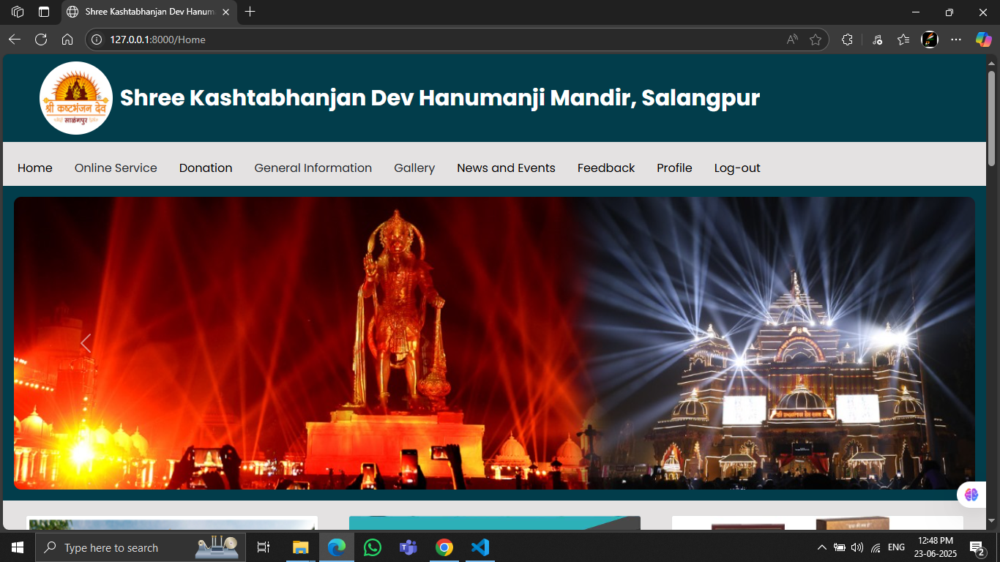
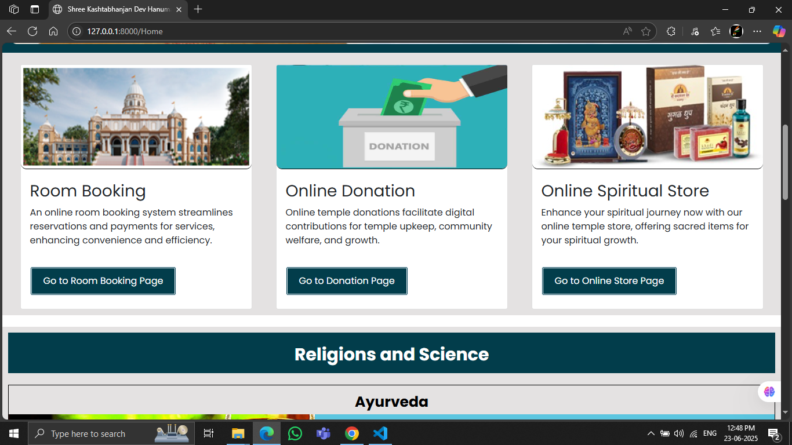
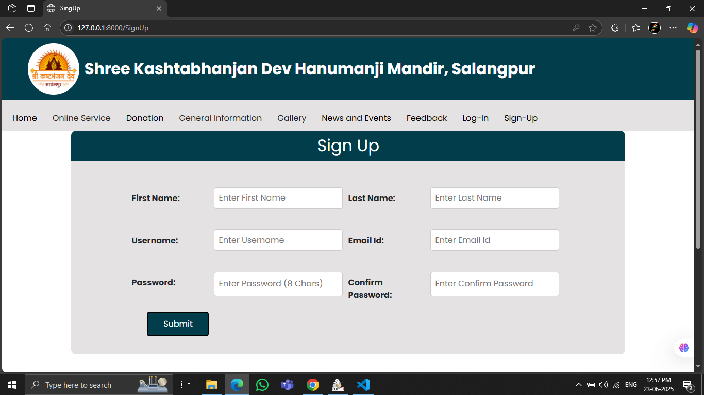
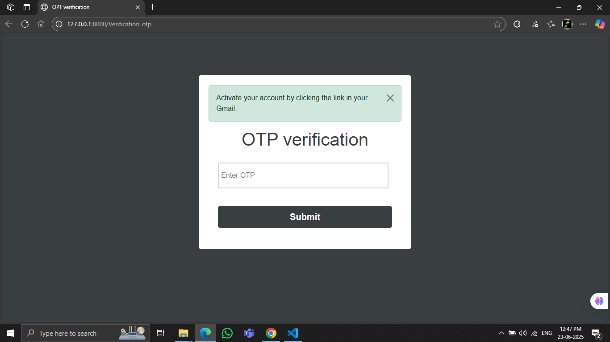
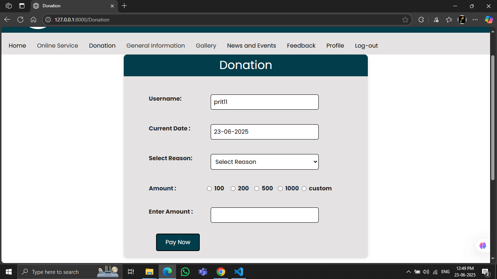
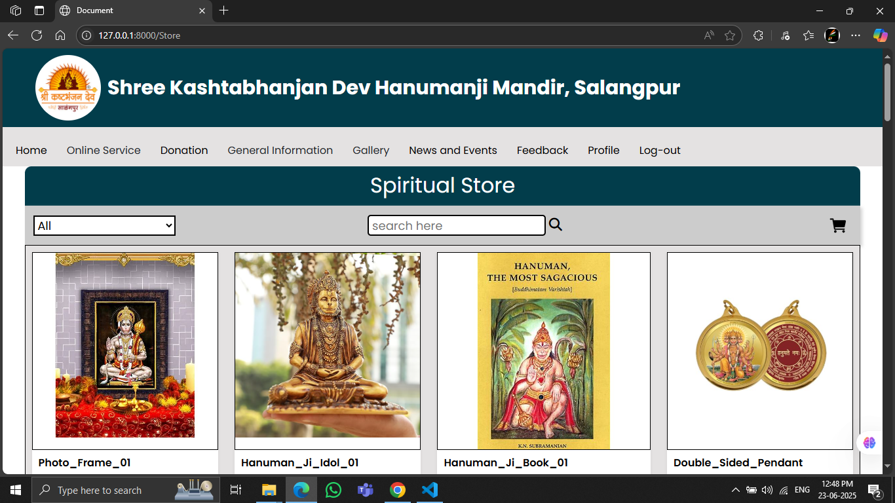

<h1 align="center">Temple Management System</h1>

<b>
A complete web-based solution to streamline temple administration, online room booking, donation handling, and spiritual store operations for  <u>Shree Kashtabhanjan Dev Hanumanji Mandir</u> (Salangpur).
</b>

<h3>Developed by:</h3>

<ul>
  <li>Jogani Prit Nayneshbhai (3117)</li>
  <li>Patel Raj Shaileshbhai (3141)</li>
  <li>Thakkar Nisarg Kiritbhai (3176)</li>
</ul>

---

## 📑 Table of Contents

- Project Overview
- Features
- Technologies Used
- System Requirements
- Installation Guide
- Modules
- Screenshots
- Limitations
- Future Scope
- Contributing
- Contact

---

## 📌 Project Overview

The <b>Temple Management System</b> is designed to address inefficiencies in the traditional management system used by the temple. It enables digital room booking, donation handling, online order processing, and communication between devotees and temple staff.

---

## ✨ Features

<ul>
  <li>User Registration & Secure Login</li>
  <li>Online Room Booking</li>
  <li>Online Donation System with Categories</li>
  <li>Spiritual Store (Idols, Books, Pendants)</li>
  <li>Event & News Management</li>
  <li>Admin Dashboard with Analytics & Reports</li>
  <li>Feedback and Customer Support</li>
  <li>Inventory Management</li>
  <li>Data Privacy and Secure Transactions</li>
</ul>
 
---

## 🧰 Technologies Used

- <b>Frontend:</b> HTML5, CSS3, JavaScript  
- <b>Backend:</b> Python (Django Framework)  
- <b>Database:</b> SQLite  
- <b>Server:</b> Apache (localhost for development)  
- <b>Payment Gateway:</b> Razorpay (test mode)  
- <b>Diagramming:</b> UML (Use-Case, Activity, Class, Sequence)
 
---

## 💻 System Requirements

### 🖥️ Client Side
- OS: Windows 7 or higher  
- Browser: Chrome (v109.0+) or Firefox (v115.0+)  
- Hardware: Core i3+, 2GB+ RAM, 4GB+ HDD

### 🗄️ Server Side
- OS: Windows/Linux  
- Server: Apache  
- Hardware: Core i3+, 4GB+ RAM, 16GB+ HDD  
- Database: SQLite

---

## ⚙️ Installation Guide

1. **Clone the repository**

   git clone git remote add origin https://github.com/nisarg4534/Temple-Management-System.git
   cd temple-management-system

2. **Create a virtual environment**
  python -m venv venv
  source venv/bin/activate  # On Windows: venv\Scripts\activate

3. **Install dependencies**
  pip install -r requirements.txt

4. **Run migrations**
  python manage.py makemigrations
  python manage.py migrate

5. **Run the server**

   python manage.py runserver

7. **Visit**: http://127.0.0.1:8000
 

📦 Modules
  🙍‍♂️ User Panel:
    <ui>
    <li>Register/Login</li>
    <li>View Events, News, Rituals</li>
    <li>Donate Online</li>
    <li>Book Temple Rooms</li>
    <li>Purchase from Spiritual Store</li>
    <li>Give Feedback<li>
    </ui> 

  🛠️ Admin Panel:
    <ui>
    <li>Manage Users,Donations, Bookings</li>
    <li>Inventory & Order Management</li>
    <li>View Feedback</li>
    <li>Generate Reports</li>
    </ui>
     

  ## 🖼️ Screenshots

### 🏠 Home Page

  
  
  
  

### 🔐 Login

### 📝 Register

  
  
  

### 🛏️ Room Booking

### 💳 Donation

### 🛍️ Spiritual Store

  
  

### 💬 Feedback

### 👤 Profile

### 🖼️ Photo Gallery

### 📢 News and Alerts

 
  ⚠️ Limitations
    
  <ui>
    <li>Room booking updates are not reflected after checkout.</li>
    <li>Limited product availability in the store.</li>
    <li>No Cash on Delivery (COD) option.</li>
    <li>Basic payment options only (no UPI or international methods).</li>
    <li>Basic shipping (no live tracking).</li>
  </ui> 

  🔮 Future Scope

  <ui>  
    <li>Biometric or facial recognition login</li>
    <li>Advanced analytics with AI/ML</li>
    <li>Social media integration for event promotion</li>
    <li>Real-time inventory & shipping tracking</li>
    <li>Automation for volunteer/event/resource management</li>
    <li>Mobile App version for Android/iOS</li>
  </ui>

  
🤝 Contributing
     Want to contribute? Great! Fork this repo and raise a pull request. 

  📧 Contact
    For queries or collaboration: 
      📨 templemanagementsystem66@gmail.com
